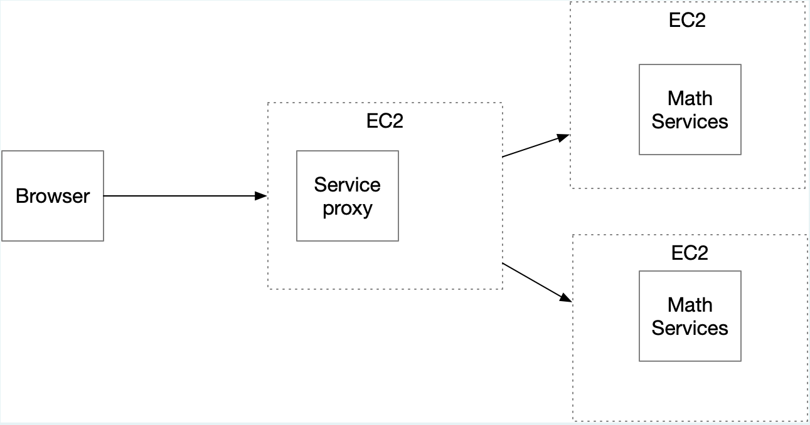

# Parcial 2

### Descripción

El proyecto Parcial 2 consiste en una aplicación Java que proporciona servicios para realizar búsquedas lineales y binarias en listas de enteros. Además, incluye un proxy de servicio para enrutar solicitudes de búsqueda a diferentes servidores, con el objetivo de distribuir la carga de manera uniforme entre ellos.

### Estructura del Repositorio

El repositorio contiene los siguientes componentes:

- **src/main/java/org/example:** Este directorio contiene los archivos fuente del proyecto.
- **src/test/java/org/example:** Aquí se encuentran las pruebas unitarias para las clases del proyecto.
- **pom.xml:** Archivo de configuración de Maven que define las dependencias del proyecto y otros detalles de construcción.

### Componentes Principales

Los componentes principales del proyecto son:

- **HttpConnectionExample:** Clase que proporciona métodos para realizar solicitudes HTTP GET y manejar las respuestas.
- **MthService:** Clase que ofrece servicios para realizar búsquedas lineales y binarias en listas de enteros a través de solicitudes HTTP GET.
- **ServiceProxy:** Clase que actúa como un proxy de servicio para enrutar solicitudes de búsqueda a diferentes servidores, utilizando un balanceo de carga round-robin.

### Arquitectura

El sistema se despliega en tres máquinas virtuales de EC2 de AWS. Dos de estas instancias alojan los servicios de búsqueda (búsqueda lineal y búsqueda binaria), mientras que la tercera instancia ejecuta el servicio proxy. Este diseño permite una distribución eficiente de la carga de trabajo y una escalabilidad horizontal.

### Flujo de Trabajo

El flujo de trabajo del proyecto es el siguiente:

1. El usuario envía una solicitud de búsqueda lineal o binaria especificando la lista de enteros y el valor a buscar.
2. La solicitud se enruta al servidor adecuado utilizando el proxy de servicio, que utiliza un balanceo de carga round-robin.
3. El servidor procesa la solicitud utilizando el servicio correspondiente y devuelve el resultado al usuario.

### Ejemplo de Uso

A continuación, se muestra un ejemplo de despliegue del proyecto en AWS:

[Despliegue en AWS](https://youtu.be/dQngMLJuoY8)

### Instrucciones de Ejecución

Para ejecutar el proyecto, sigue estos pasos:

1. Clona el repositorio desde GitHub, se debe tener instalado.
2. Abre el proyecto en tu entorno de desarrollo Java preferido, se debe tener instalado.
3. Compila el proyecto y asegúrate de resolver todas las dependencias de Maven `mvn clean install`.
4. Ejecuta la clase `MthService` por medio del comando `java -cp "target/classes:target/dependency/*" org.example.MthService`.
5. Ejecuta la clase `ServiceProxy` por medio del comando `java -cp "target/classes;target/dependency/*" org.example.ServiceProxy`.
6. Procede a tu navegador y corre `localhost:4573/index.html`, acá encontrarás los formularios, esto en local
7. Ya en aws se corre `maquina_ip:4573/index.html`(Para el despliegue detallado se realizó en dos maquinas diferentes, en cada una corriendo una version del proyecto, con sus puertos previamente abiertos)
